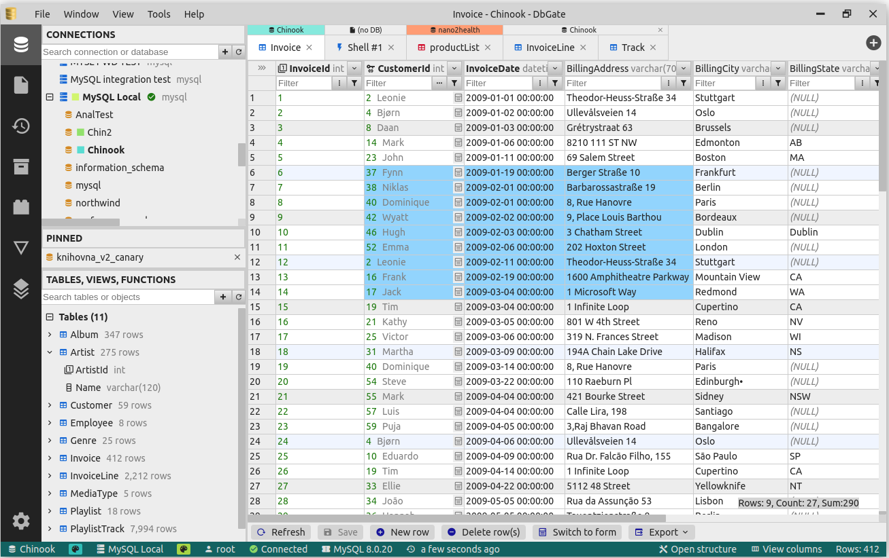

# DbGate CI/CD pipeline

Deploy DbGate server with CI/CD on Elestio

 
 

# Once deployed ...

You can open DbGate UI here:

    URL: https://[CI_CD_DOMAIN]
    email: admin
    password: [ADMIN_PASSWORD]

# Configuration

If you want to add a new db, follow these steps:

**_step1_** Open Elestio dashboard > Service overview > click on UPDATE CONFIG button > Docker Compose

**_step2_** If you want to add a new db MySQL for example, just add on environment variables `CONNECTIONS` `con1,con2` in place of `con1`

**_step3_** In environment add these:

    LABEL_con2: MySql => this will be the name shown on DbGate of your db
    SERVER_con2: mysql => the host of your db
    USER_con2: root => login
    PASSWORD_con2: TEST => password
    PORT_con2: 3306 => port of the db
    ENGINE_con2: mysql@dbgate-plugin-mysql => depend of your db, you can find engine value in the list of engines below

**_step4_** Click on `Update & Restart`, your db will be shown in DbGate

# Engines

    mssql@dbgate-plugin-mssql - Microsoft SQL Server
    mysql@dbgate-plugin-mysql - MySQL
    mariadb@dbgate-plugin-mysql - MariaDB
    postgres@dbgate-plugin-postgres - PostgreSQL
    cockroach@dbgate-plugin-postgres - CockroachDB
    redshift@dbgate-plugin-postgres - Amazon Redshift
    sqlite@dbgate-plugin-sqlite - SQLite
    mongo@dbgate-plugin-mongo - MongoDB

# Documentation

You can read the documentation here: <a href="https://dbgate.org/docs/index.html" target="_blank">DbGate's documentation</a>
